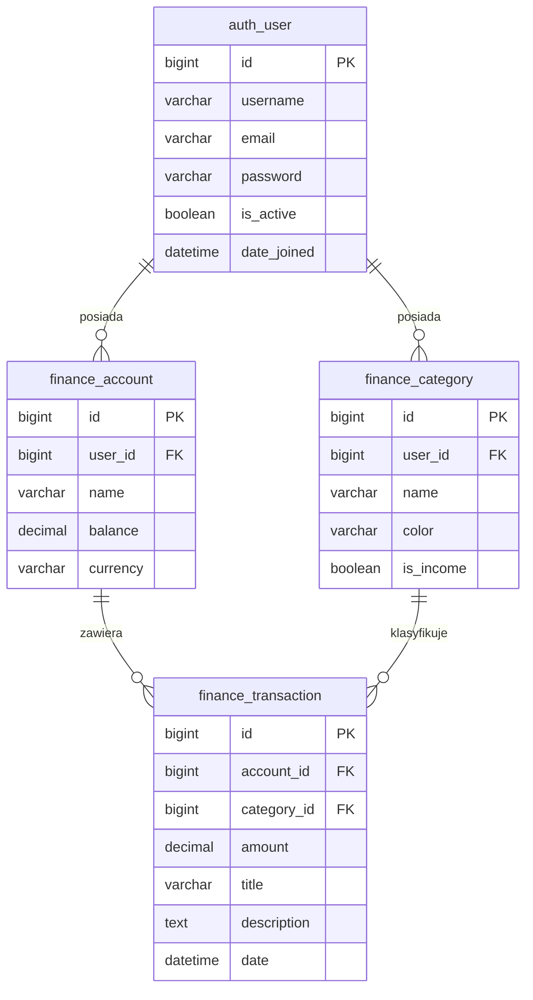

# Schemat bazy danych

Projekt używa PostgreSQL. Definicje tabel znajdują się w `backend/finance/models.py`, a historia zmian w `backend/finance/migrations/`.

## Diagram

## Tabele

### auth_user

Wbudowana tabela Django. Nie jest definiowana w projekcie — pochodzi z `django.contrib.auth`.

| Pole | Typ | Opis |
|---|---|---|
| id | bigint PK | Klucz główny |
| username | varchar | Nazwa użytkownika |
| email | varchar | Adres e-mail |
| password | varchar | Hasło (hash) |
| is_active | boolean | Czy konto jest aktywne |
| date_joined | datetime | Data rejestracji |

---

### finance_account

Konto finansowe użytkownika (np. konto bankowe, gotówka). Zdefiniowane w `backend/finance/models.py`.

| Pole | Typ | Opis |
|---|---|---|
| id | bigint PK | Klucz główny |
| user_id | bigint FK | Właściciel konta → auth_user (CASCADE) |
| name | varchar(50) | Nazwa konta |
| balance | decimal(12,2) | Aktualne saldo, aktualizowane przez serwis przy każdej transakcji |
| currency | varchar(3) | Waluta, domyślnie PLN. Dozwolone wartości w `backend/finance/constants.py` |

---

### finance_category

Kategoria transakcji przypisana do użytkownika. Zdefiniowane w `backend/finance/models.py`.

| Pole | Typ | Opis |
|---|---|---|
| id | bigint PK | Klucz główny |
| user_id | bigint FK | Właściciel kategorii → auth_user (CASCADE) |
| name | varchar(50) | Nazwa kategorii |
| color | varchar(7) | Kolor w formacie HEX, wybierany z palety w `backend/finance/constants.py` |
| is_income | boolean | True = przychód, False = wydatek |

---

### finance_transaction

Pojedyncza transakcja finansowa. Zdefiniowane w `backend/finance/models.py`.

| Pole | Typ | Opis |
|---|---|---|
| id | bigint PK | Klucz główny |
| account_id | bigint FK | Konto transakcji → finance_account (CASCADE) |
| category_id | bigint FK | Kategoria → finance_category (SET NULL, nullable) |
| amount | decimal(12,2) | Kwota: ujemna = wydatek, dodatnia = przychód |
| title | varchar(200) | Tytuł transakcji |
| description | text | Opis, opcjonalny |
| date | datetime | Data transakcji, domyślnie moment utworzenia |

## Relacje

| Relacja | Typ | Zachowanie przy usunięciu |
|---|---|---|
| auth_user → finance_account | 1:N | CASCADE — usunięcie użytkownika usuwa jego konta |
| auth_user → finance_category | 1:N | CASCADE — usunięcie użytkownika usuwa jego kategorie |
| finance_account → finance_transaction | 1:N | CASCADE — usunięcie konta usuwa jego transakcje |
| finance_category → finance_transaction | 1:N | SET NULL — usunięcie kategorii pozostawia transakcje bez kategorii |

## Historia migracji

| Migracja | Zmiany |
|---|---|
| `0001_initial` | Utworzenie tabel Account, Category, Transaction |
| `0002_model_changes` | Usunięcie pola `icon` z Category, zmiana domyślnego koloru kategorii, zmiana `date` w Transaction z `auto_now_add` na `default=now` |
